# NXTQR Authoritative Relational Database Architecture

**NXTQR — Smart QR Infrastructure**  
*Production Cloudflare D1 / SQLite Relational Schema, Constraints, Multi-Tenancy, and Index Matrix*

---

## 1. Architectural Philosophy

1. **D1 is the Authoritative Source of Relational Truth**:
   - All tenant boundaries, users, access roles, QR asset definitions, routing configurations, billing events, and governance records reside authoritatively in Cloudflare D1.
   - KV is a disposable snapshot cache; R2 holds object bytes with ownership tracked in D1; Queues transport work asynchronously.
2. **Strict Server-Side Organization Scoping**:
   - Every business resource explicitly references `organization_id` (or is deterministically resolved to an authoritative parent).
   - Client-provided `organization_id` is never trusted; authorization middleware strictly validates `Actor -> Membership -> Role -> Permission -> Entitlement -> Resource Tenancy`.
3. **No Float/Real Currencies**:
   - All monetary amounts use integer minor units (`amount_minor`, `price_minor`, e.g., 99900 = ₹999.00). Floating-point drift in billing is eliminated.
4. **Draft vs Published Revision Isolation**:
   - Control plane edits update draft working revisions (`current_version_id`), while the edge resolver reads only the immutable snapshot derived from `published_version_id`.
5. **Idempotent Webhooks & Events**:
   - Provider payment webhooks and async queue consumers require idempotency boundaries via composite uniqueness (e.g. `UNIQUE(provider, provider_event_key)`).

---

## 2. Entity-Relationship Model

```mermaid
erDiagram
    USERS ||--o{ AUTH_ACCOUNTS : "identities"
    USERS ||--o{ ORGANIZATION_MEMBERS : "joins"
    ORGANIZATIONS ||--o{ ORGANIZATION_MEMBERS : "has"
    ORGANIZATIONS ||--o{ TEAMS : "groups"
    TEAMS ||--o{ TEAM_MEMBERS : "contains"
    ORGANIZATION_MEMBERS ||--o{ MEMBER_ROLES : "assigned"
    ROLES ||--o{ ROLE_PERMISSIONS : "authorizes"
    PERMISSIONS ||--o{ ROLE_PERMISSIONS : "grants"
    
    ORGANIZATIONS ||--o{ QR_CODES : "owns"
    QR_CODES ||--o{ QR_VERSIONS : "revisions"
    QR_CODES ||--o{ QR_DESTINATIONS : "targets"
    QR_CODES ||--o{ QR_DESIGNS : "styling"
    QR_CODES ||--o{ QR_RULES : "routes"
    QR_RULES ||--o{ QR_RULE_CONDITIONS : "evaluates"
    QR_CODES ||--o{ EXPERIMENTS : "A-B tests"
    EXPERIMENTS ||--o{ EXPERIMENT_VARIANTS : "branches"
    
    ORGANIZATIONS ||--o{ CAMPAIGNS : "schedules"
    ORGANIZATIONS ||--o{ FOLDERS : "organizes"
    ORGANIZATIONS ||--o{ TAGS : "labels"
    QR_CODES ||--o{ QR_TAGS : "tagged"
    TAGS ||--o{ QR_TAGS : "assigned"
    
    ORGANIZATIONS ||--o{ SUBSCRIPTIONS : "subscribes"
    ORGANIZATIONS ||--o{ PAYMENTS : "billed"
    PAYMENT_EVENTS }|..|| PAYMENTS : "idempotency"
    ORGANIZATIONS ||--o{ ENTITLEMENTS : "quotas"
    PLANS ||--o{ PLAN_FEATURES : "defines"
    
    ORGANIZATIONS ||--o{ API_KEYS : "credentials"
    API_KEYS ||--o{ API_KEY_SCOPES : "scopes"
    ORGANIZATIONS ||--o{ WEBHOOK_ENDPOINTS : "dispatches"
    WEBHOOK_ENDPOINTS ||--o{ WEBHOOK_SUBSCRIPTIONS : "listens"
    WEBHOOK_EVENTS ||--o{ WEBHOOK_DELIVERIES : "triggers"
    WEBHOOK_DELIVERIES ||--o{ WEBHOOK_ATTEMPTS : "records"
    
    ORGANIZATIONS ||--o{ AUDIT_LOGS : "governance"
    ORGANIZATIONS ||--o{ ACTIVITY_EVENTS : "timeline"
    ORGANIZATIONS ||--o{ R2_ASSETS : "objects"
    ORGANIZATIONS ||--o{ SAVED_REPORTS : "templates"
    SAVED_REPORTS ||--o{ REPORT_SCHEDULES : "automates"
    ORGANIZATIONS ||--o{ REPORT_JOBS : "generates"
```

---

## 3. Table Catalog & Constraint Matrix

### 3.1 Identity & Authentication
- `users`: Core profile (`id`, `email`, `name`, `avatar_url`, `timezone`, `created_at`, `updated_at`).
- `auth_accounts`: Authoritative provider identity boundary (`id`, `user_id`, `provider`, `provider_account_id`).  
  **Constraint**: `UNIQUE(provider, provider_account_id)` prevents account collision and replay.
- `sessions`: Ephemeral token records (`id`, `user_id`, `token_hash`, `expires_at`).

### 3.2 Tenancy & Workspaces
- `organizations`: Authoritative tenant container (`id`, `name`, `slug`, `logo_url`, `billing_plan`, `created_at`).  
  **Constraint**: `UNIQUE(slug)` with reserved names protected server-side.
- `organization_members`: Member membership (`id`, `organization_id`, `user_id`, `status`, `joined_at`).  
  **Constraint**: `UNIQUE(organization_id, user_id)` guarantees single active membership per workspace.
- `teams`: Organizational sub-units (`id`, `organization_id`, `name`, `description`).
- `team_members`: Membership in team (`id`, `team_id`, `member_id`).  
  **Constraint**: `UNIQUE(team_id, member_id)`.
- `invitations`: Workspace invites (`id`, `organization_id`, `email`, `role_id`, `token_hash`, `expires_at`, `status`).  
  **Constraint**: Plaintext tokens are never stored; token hash is validated idempotently.

### 3.3 RBAC (Roles & Permissions)
- `roles`: RBAC roles (`id`, `organization_id`, `name`, `is_system`). Global roles have `organization_id IS NULL`.
- `permissions`: Authoritative permission registry (`id`, `code`, `category`, `description`).
- `role_permissions`: Association (`role_id`, `permission_id`). `PRIMARY KEY(role_id, permission_id)`.
- `member_roles`: Member-role mapping (`member_id`, `role_id`). `PRIMARY KEY(member_id, role_id)`.

### 3.4 QR Infrastructure & Versioning
- `qr_codes`: Root QR resource:
  - `id`: Unique identifier (`qr_...`)
  - `organization_id`: Explicit tenant owner
  - `slug`: Edge redirect path (`UNIQUE(slug)`)
  - `status`: `DRAFT` | `ACTIVE` | `PAUSED` | `SCHEDULED` | `EXPIRED` | `ARCHIVED`
  - `current_version_id`: Working draft revision
  - `published_version_id`: Active edge-published revision (decoupled from drafts)
  - `published_at`: Timestamp of edge deployment
- `qr_destinations`: Destination configurations (`id`, `qr_id`, `default_url`, `fallback_url`, `password_hash`, `starts_at`, `expires_at`, `utm_*`).
- `qr_designs`: Visual styling (`id`, `qr_id`, `pixel_style`, `eye_style`, `fg_color`, `bg_color`, `logo_url`, `error_correction`, `scanability_score`).
- `qr_versions`: Immutable historical snapshots (`id`, `qr_id`, `version_number`, `destination_id`, `design_id`, `change_summary`, `created_by`, `created_at`).  
  **Constraint**: `UNIQUE(qr_id, version_number)`.

### 3.5 Intelligent Routing & A/B Experiments
- `qr_rules`: Priority-ordered routing rules (`id`, `qr_id`, `name`, `priority`, `is_active`, `destination_url`, `match_type`, `action_type`).
- `qr_rule_conditions`: Criteria (`id`, `rule_id`, `condition_type`, `operator`, `value_json`).
- `experiments`: A/B destination experiments (`id`, `qr_id`, `name`, `status`).
- `experiment_variants`: Traffic splits (`id`, `experiment_id`, `name`, `destination_url`, `traffic_weight`).
- `experiment_assignments`: Sticky user allocation (`id`, `experiment_id`, `scanner_token_hash`, `variant_id`).  
  **Constraint**: `UNIQUE(experiment_id, scanner_token_hash)`.

### 3.6 Link Guardian (Automated Recovery)
- `link_checks`: Historical HTTP probes (`id`, `qr_id`, `checked_url`, `http_status`, `response_time_ms`, `tls_valid`, `status`, `failure_reason`, `checked_at`).
  *Bounded retention indexed by `checked_at DESC`.*
- `guardian_incidents`: Tracked outages (`id`, `organization_id`, `qr_id`, `status`, `started_at`, `resolved_at`, `failure_reason`, `fallback_triggered`).
- `fallback_policies`: Automated failover rules (`id`, `qr_id`, `failure_threshold`, `backup_url`, `auto_switch`, `notify_emails_json`).

### 3.7 Analytics & Telemetry (Rollups)
- `scan_events_hourly`: Dimensional rollups populated asynchronously from queues (`id`, `qr_id`, `organization_id`, `hour_bucket`, `total_scans`, `estimated_unique_scans`, `country_code`, `device_type`, `os_name`, `browser_name`).  
  **Constraint**: `UNIQUE(qr_id, hour_bucket, country_code, device_type, os_name)` for queue worker UPSERTs.
- `conversion_events`: Goal conversions (`id`, `qr_id`, `organization_id`, `event_name`, `value_minor`, `currency`, `created_at`).

### 3.8 Billing & Commerce (Cashfree)
- `plans`: SaaS tier catalog (`id`, `name`, `tier_level`, `monthly_price_minor`, `annual_price_minor`).
- `subscriptions`: Active subscriptions (`id`, `organization_id`, `provider`, `provider_subscription_id`, `plan_id`, `status`, `current_period_start`, `current_period_end`).  
  **Constraint**: `UNIQUE(organization_id)` and `UNIQUE(provider, provider_subscription_id)`.
- `payments`: Cashfree transaction records (`id`, `organization_id`, `cashfree_order_id`, `amount_minor`, `currency`, `status`, `payment_method`, `signature_verified`).  
  **Constraint**: `UNIQUE(cashfree_order_id)`.
- `payment_events`: Webhook event ledger (`id`, `provider`, `provider_event_key`, `event_type`, `payload_hash`, `status`, `processed_at`).  
  **Constraint**: `UNIQUE(provider, provider_event_key)` guarantees zero double-crediting.
- `entitlements`: Quota tracking (`id`, `organization_id`, `feature_key`, `boolean_allowed`, `numeric_limit`, `current_usage`, `reset_period`).

### 3.9 Developer Platform & Webhooks
- `api_keys`: API credentials (`id`, `organization_id`, `name`, `prefix`, `key_hash`, `status`, `last_used_at`, `expires_at`).  
  **Constraint**: Plaintext keys are never stored; `UNIQUE(key_hash)`.
- `api_key_scopes`: Granular permissions (`api_key_id`, `scope`). `PRIMARY KEY(api_key_id, scope)`.
- `webhook_endpoints`: Customer destinations (`id`, `organization_id`, `url`, `secret_hash`, `signing_secret`, `status`).
- `webhook_subscriptions`: Subscribed events (`endpoint_id`, `event_type`). `PRIMARY KEY(endpoint_id, event_type)`.
- `webhook_events`: Outbound event log (`id`, `organization_id`, `event_type`, `resource_type`, `resource_id`, `payload_json`).
- `webhook_deliveries`: Logical deliveries (`id`, `event_id`, `endpoint_id`, `status`, `attempt_count`, `next_retry_at`).  
  **Constraint**: `UNIQUE(event_id, endpoint_id)` prevents duplicate logical dispatches.
- `webhook_attempts`: Delivery probe log (`id`, `delivery_id`, `attempt_number`, `status`, `response_code`, `duration_ms`, `error_message`).

### 3.10 Governance, Audit & Collaboration
- `audit_logs`: Immutable compliance audit trail (`id`, `organization_id`, `actor_id`, `action`, `resource_type`, `resource_id`, `metadata_json`, `ip_hash`).
- `activity_events`: User-facing product activity stream (`id`, `organization_id`, `actor_id`, `action`, `resource_type`, `resource_id`, `metadata_json`).
- `comments`: Asset discussions (`id`, `organization_id`, `resource_type`, `resource_id`, `author_id`, `content`, `resolved`).
- `mentions`: Tagged collaborators (`id`, `comment_id`, `user_id`, `read_at`). `UNIQUE(comment_id, user_id)`.
- `approval_requests`: Publication workflows (`id`, `organization_id`, `qr_id`, `requested_by`, `target_version_id`, `status`, `decision_note`, `decided_by`).
- `share_links`: Secure guest previews (`id`, `organization_id`, `resource_type`, `resource_id`, `token_hash`, `permission`, `password_hash`, `expires_at`).  
  **Constraint**: `UNIQUE(token_hash)`.
- `r2_assets`: Object ownership registry (`id`, `organization_id`, `bucket_name`, `object_key`, `file_name`, `content_type`, `size_bytes`, `status`).  
  **Constraint**: `UNIQUE(object_key)`.

---

## 4. Index Matrix & Query Justifications

| Table | Index Columns | Supported Access Path |
| :--- | :--- | :--- |
| `qr_codes` | `(slug)` | Primary redirect fallback lookup on KV cache miss. |
| `qr_codes` | `(organization_id, status)` | Filtered dashboard QR asset listings. |
| `qr_rules` | `(qr_id, priority)` | Deterministic ordered rule evaluation for edge snapshot compilation. |
| `organization_members` | `(organization_id)` | Team member list queries. |
| `organization_members` | `(user_id)` | Workspace switching list for authenticated user. |
| `scan_events_hourly` | `(qr_id, hour_bucket, country_code, device_type, os_name)` | Composite unique constraint required for queue worker UPSERTs. |
| `scan_events_hourly` | `(qr_id, hour_bucket)` | QR-specific time-series analytics charts. |
| `scan_events_hourly` | `(organization_id, hour_bucket)` | Workspace-wide KPI aggregation rollups. |
| `link_checks` | `(checked_at DESC)` | Bounded retention pruning (`pruneOldGuardianChecks`). |
| `link_checks` | `(qr_id, checked_at DESC)` | Recent health status query in Guardian module. |
| `activity_events` | `(organization_id, created_at DESC)` | Workspace product activity feed. |
| `audit_logs` | `(organization_id, created_at DESC)` | Security compliance timeline pagination. |
| `webhook_deliveries` | `(status, next_retry_at)` | Background worker retry queue poll. |
| `report_jobs` | `(organization_id, created_at DESC)` | User report download history. |
| `report_jobs` | `(status, created_at ASC)` | Async report worker queue consumer. |
| `r2_assets` | `(organization_id, bucket_name)` | Asset manager listings and tenant isolation verification. |
| `subscriptions` | `(provider, provider_subscription_id)` | Cashfree subscription webhook lookups. |

---

## 5. Critical Transaction Boundaries

1. **Invitation Acceptance**:
   - `BEGIN TRANSACTION`
   - Insert `organization_members(organization_id, user_id, status = 'active')`.
   - Insert `member_roles(member_id, role_id)`.
   - Update `invitations(status = 'accepted', accepted_at = now)`.
   - `COMMIT`
2. **QR Edge Publication**:
   - `BEGIN TRANSACTION`
   - Insert new `qr_versions` with deterministic incremented `version_number`.
   - Update `qr_codes(current_version_id = new_ver, published_version_id = new_ver, published_at = now)`.
   - Post-commit: Asynchronously publish compiled `RedirectSnapshot` to `REDIRECT_KV`.
   - `COMMIT`
3. **Cashfree Payment Webhook**:
   - `BEGIN TRANSACTION`
   - Insert `payment_events(provider, provider_event_key, event_type, payload_hash)`. If duplicate: `ROLLBACK / IGNORE`.
   - Update `payments(status = 'SUCCESS')`.
   - Update `subscriptions(status = 'ACTIVE', current_period_end = ...)`.
   - Upsert `entitlements`.
   - Record `audit_logs`.
   - `COMMIT`
